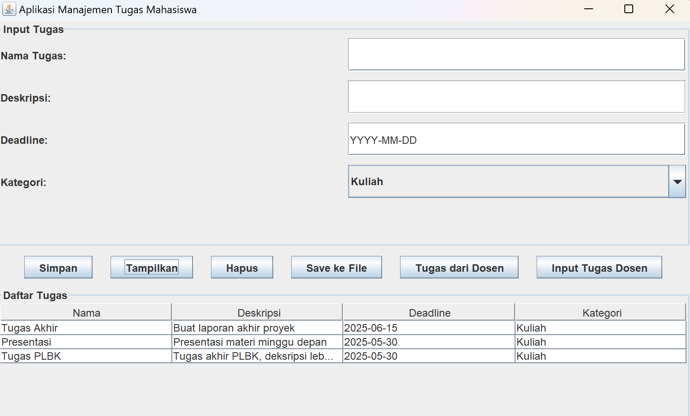

# 📚 SELESAI.IN - Aplikasi Manajemen Tugas Mahasiswa

Aplikasi desktop sederhana berbasis **Java Swing** untuk membantu mahasiswa dalam mengelola dan mencatat berbagai tugas dari kuliah, organisasi, maupun tugas pribadi. Dosen juga dapat memberikan tugas secara otomatis maupun manual ke dalam sistem.

---

### 👨‍🏫 Kontributor
Dibuat dengan ❤️ oleh Mahasiswa untuk Mahasiswa
Fathiya Namira Fardhi (2208107010071)
Iwani Khairina (2208107010078)

## ✨ Fitur Utama

- Menambahkan tugas dengan nama, deskripsi, deadline, dan kategori.
- Menampilkan semua daftar tugas dalam tabel.
- Menghapus tugas yang dipilih dari daftar.
- Menyimpan semua tugas ke file teks (`tugas.txt`).
- Menambahkan tugas dari dosen secara otomatis saat aplikasi dijalankan.
- Tombol khusus untuk menambahkan tugas dari dosen secara manual.

---

## 📌 Struktur Kelas

### `Tugas`
Mewakili data tugas yang terdiri dari:
- `nama`
- `deskripsi`
- `deadline`
- `kategori`

### `Dosen`
Mewakili entitas dosen yang dapat memberikan tugas kepada mahasiswa.

### `ManajemenTugasMahasiswa`
Antarmuka pengguna utama dengan komponen-komponen GUI seperti:
- Input data tugas
- Tombol aksi (simpan, tampilkan, hapus, simpan ke file, tambah tugas dosen)
- Tabel daftar tugas

---
### 🧑‍🏫 Peran dalam Sistem
- Mahasiswa: Menambahkan, melihat, dan menghapus tugasnya sendiri.
- Dosen: Memberikan tugas ke dalam sistem (otomatis maupun manual).

---

## 🧑‍💻 Teknologi yang Digunakan

- Java SE
- Java Swing
- JTable
- FileWriter (untuk penyimpanan lokal)

### 🧪 Contoh Output
Tugas-tugas yang ditambahkan dapat disimpan ke dalam file tugas.txt dalam format:
Compile dan Jalankan
Jika menggunakan command line:
```bash 
javac *.java
java ManajemenTugasMahasiswa
```



